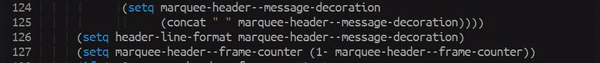

[](https://travis-ci.com/jcs090218/marquee-header)
[](https://melpa.org/#/marquee-header)
[](https://www.gnu.org/licenses/gpl-3.0)


# marquee-header
> Code interface for displaying marquee in header.

<p align="center">
  
</p>


## Usage

You can make marquee by using the function `marquee-header-notify` like this.

### Functions

```el
(marquee-header-notify "You got message!!~"  ; Message
                        10.0                 ; Time
                        'left)               ; Direction
```

### Directions

* **none** - just display it without moving it.
* **right** - Move from left to the right.
* **left** - Move from right to the left.  [Default]


## Contribution

If you would like to contribute to this project, you may either
clone and make pull requests to this repository. Or you can
clone the project and establish your own branch of this tool.
Any methods are welcome!
